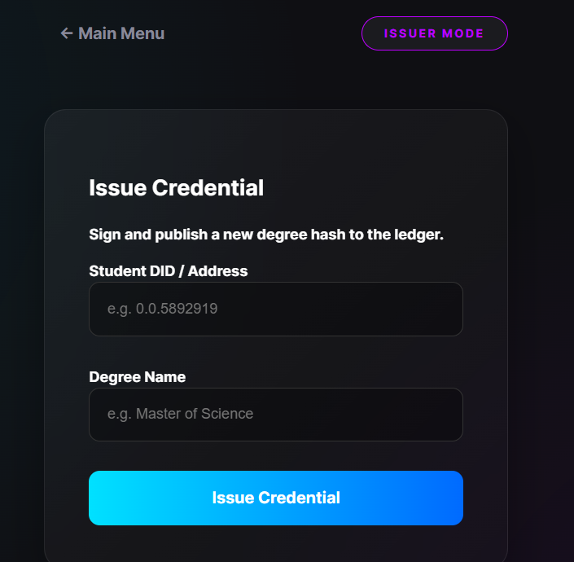
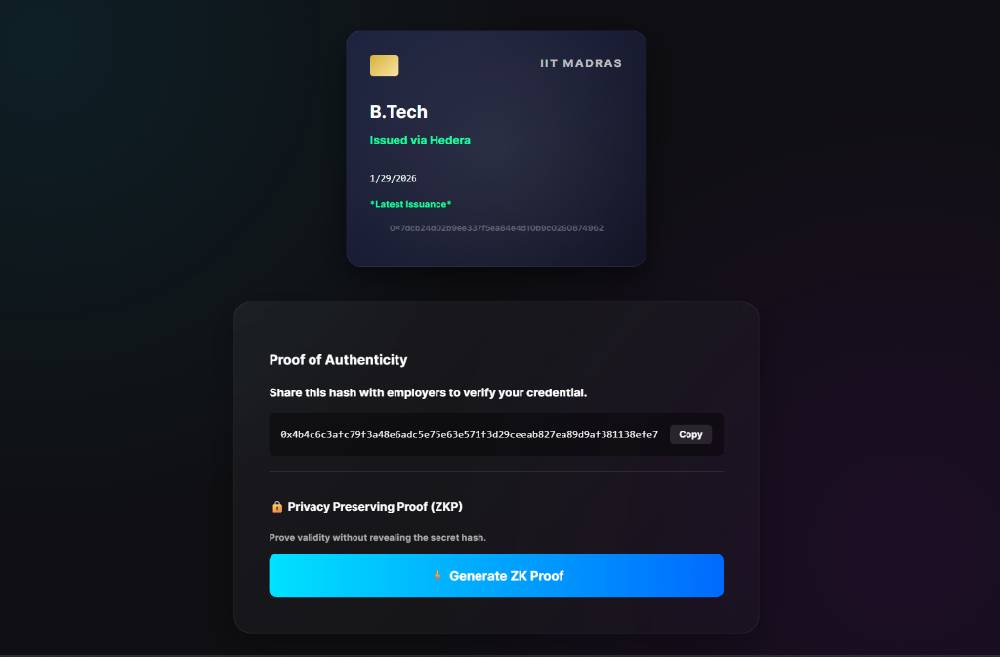
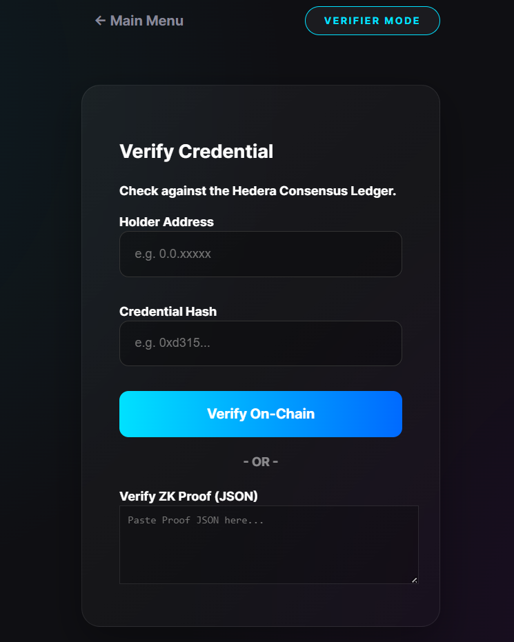

# Project Presentation: Privacy-Preserving Decentralized Credentials

---

## Slide 1: Title Slide
**Title:** Privacy-Preserving Decentralized Academic Credentials on Hedera Hashgraph using Zero-Knowledge Proofs
**Presenter:** [Your Name]
**Date:** January 2026
**Tech Stack:** Hedera, Solidity, Circom (ZKP), React

---

## Slide 2: The Problem
### The Crisis of Digital Identity
*   **Fraud:** Physical degrees are easily forged.
*   **Inefficiency:** Verification requires manual email/phone checks with Universities.
*   **Privacy Loss:** Public Blockchain solutions (like Blockcerts) force users to reveal *everything* to prove *anything*.
    *   *Example:* Revealing your full transcript just to prove you graduated.

---

## Slide 3: The Solution
### Hybrid Architecture: Trust + Privacy
*   **Trust Anchor:** **Hedera Hashgraph** (Public Ledger)
    *   Provides immutability and timestamping.
    *   Verifiers know the data hasn't been tampered with.
*   **Privacy Layer:** **Zero-Knowledge Proofs (Groth16)**
    *   Allows the Student to prove ownership **without** revealing the private secret or the raw file to the network.

---

## Slide 4: System Architecture
### High-Level Overview
*   **Issuer (University):** Issues a hashed credential to the Smart Contract.
*   **Holder (Student):** Stores the secret off-chain (in Browser). Generates ZK Proofs locally.
*   **Verifier (Employer):** Verifies the ZK Proof + Checks Ledger Status.

*(Diagram: High-Level Sequence Diagram from Report)*

---

## Slide 5: Key Technologies
*   **Blockchain:** Hedera Testnet (Consensus Service).
*   **Smart Contract:** Solidity (Role-Based Access Control).
*   **ZKP Circuit:** Circom (Poseidon Hash for efficiency).
*   **Frontend:** React Dashboard (Web3-enabled).

---

## Slide 6: Deep Dive: The Privacy Mechanism
### How ZKP Works Here
1.  **Secret:** Student has a secret password.
2.  **Public Hash:** The Blockchain has `Hash(Secret)`.
3.  **The Proof:** Student allows the math to prove: *"I know the value that hashes to this Public Hash."*
4.  **Result:** Employer is convinced, but learns **nothing** about the secret.

---

## Slide 7: Live Demo - Issuer Dashboard
### Issuing a Credential
*   Step 1: Admin logs in.
*   Step 2: Enters Student Address & Degree details.
*   Step 3: "Issue" transaction anchors hash on Hedera.

---

## Slide 8: Live Demo - Holder Wallet
### Generating the Proof
*   Step 1: Student views their credentials.
*   Step 2: Clicks "Generate ZK Proof".
*   Step 3: Circuit runs in the browser (~0.8s).

---

## Slide 9: Live Demo - Verifier Portal
### Verifying the Claim
*   Step 1: Employer pastes the Proof JSON.
*   Step 2: System checks ZK Math + Ledger Status.
*   Step 3: Green "Verified" Badge appears.

---

## Slide 10: Performance Results
| Metric | Value | Comparison |
| :--- | :--- | :--- |
| **Proof Gen Time** | 0.82 sec | Very Fast (Client-side) |
| **Finality** | 3.5 sec | Faster than Eth (15s) |
| **Cost** | ~$0.05 | Cheaper than Eth ($5+) |

---

## Slide 11: Conclusion
*   **Summary:** We built a scalable, privacy-first ID system.
*   **Impact:** Solving the "Privacy-Transparency" trade-off using ZK-SNARKs.
*   **Future:** Mobile App, Selective Disclosure.

---

## Slide 12: Q&A
**Thank You!**
**Codebase:** `did-cli`
**Live Demo:** Running on Localhost
