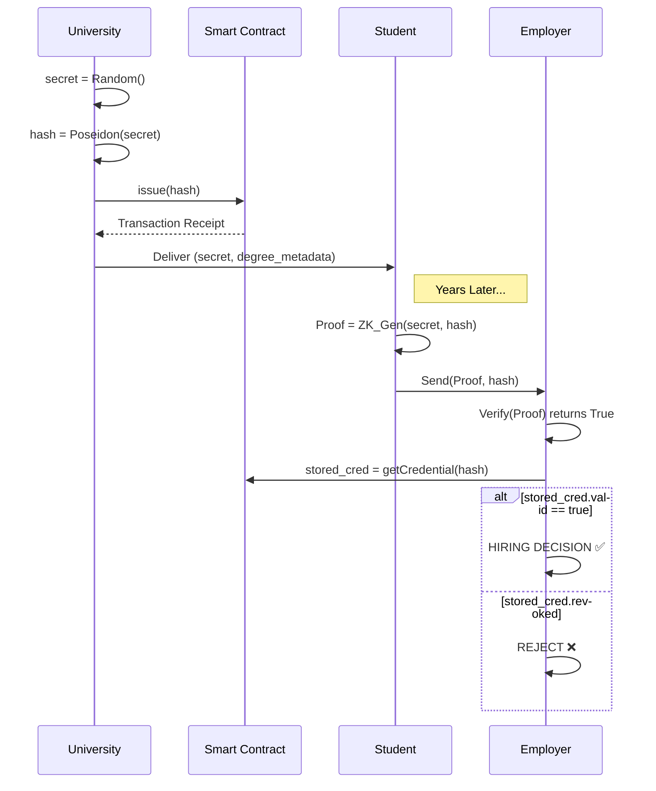
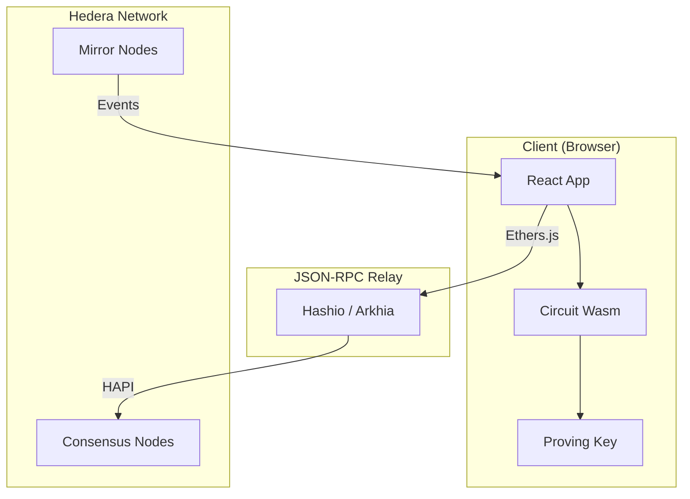
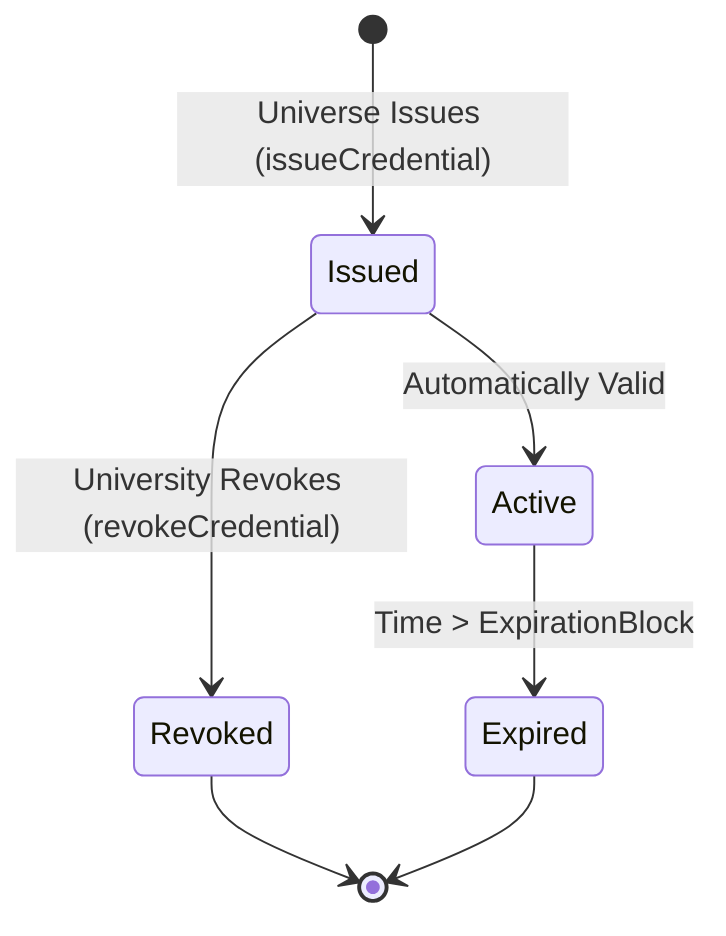
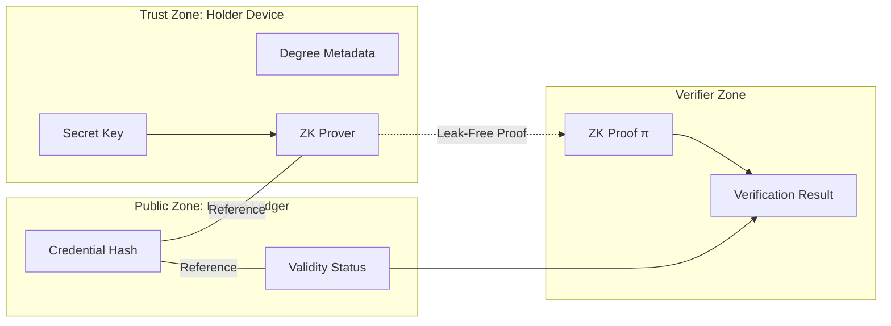

# Privacy-Preserving Decentralized Academic Credentials on Hedera Hashgraph using Zero-Knowledge Proofs

**Date:** January 2026
**Platform:** Hedera Testnet
**Key Technologies:** Solidity, Circom, SnarkJS, React

---

## 1. Abstract
The proliferation of digital educational credentials has exacerbated the issues of credential fraud, privacy infringement, and centralized dependency. Traditional verification systems rely on Public Key Infrastructure (PKI) managed by centralized Certificate Authorities (CAs), creating single points of failure. While blockchain-based solutions like Blockcerts have introduced immutability, they often suffer from the "privacy-transparency trade-off," where verifying a credential requires exposing its entire content On-Chain. 

This paper presents a novel framework for **Self-Sovereign Identity (SSI)** and **Verifiable Credentials (VC)** built on the **Hedera Hashgraph** consensus network. We propose a hybrid architecture that leverages Hedera's high-throughput Consensus Service (HCS) for trust anchoring and **Zero-Knowledge Succinct Non-Interactive Arguments of Knowledge (ZK-SNARKs)**—specifically the Groth16 protocol—for privacy-preserving verification. Our system allows a Holder (student) to cryptographically prove to a Verifier (employer) that they possess a valid credential issued by an Issuer (university) without revealing the credential's underlying secret or metadata to the public ledger. We demonstrate a working prototype capable of sub-second proof generation and millisecond verification, offering a scalable solution for privacy-respecting digital identity.

## 2. Introduction

### 2.1 Context and Motivation
In the current digital economy, the verification of attributes (degrees, licenses, age) is a frequent necessity. However, the prevailing model is **Issuer-Centric**: verifiers must contact the issuer directly, or users must carry physical documents that are easily forged. 
The transition to **User-Centric** identity (SSI) places the user in control. However, naive blockchain implementations store hashes of documents on public ledgers. If a user reveals a document to an employer, the employer can hash it and look it up on-chain. While secure, this links the user's real-world identity to a blockchain address forever, facilitating surveillance and data correlation.

### 2.2 Problem Statement
The challenge is to design a system that simultaneously satisfies three conflicting properties:
1.  **Immutability:** Credentials cannot be forged or retroactively altered.
2.  **Verifiability:** Third parties can verify authenticity without trusting the issuer online.
3.  **Privacy:** The verification process leak zero information about the credential content to the public network.

### 2.3 Contribution
We address this by implementing a **Zero-Knowledge Privacy Layer** atop the **Hedera Network**.
Our specific contributions are:
1.  **Architecture**: A decoupling of "Issuance" (On-Chain) and "Presentation" (Off-Chain ZK Proofs).
2.  **Efficiency**: Utilization of the **Poseidon Hash** function within the Arithmetic Circuit to minimize constraints (~20k constraints vs ~100k for SHA-256), enabling client-side proof generation in the browser.
3.  **Scalability**: Use of Hedera's gossip-about-gossip protocol to achieve finality in 3-5 seconds with fixed low costs (<$0.001 per verification).

## 3. Related Work

### 3.1 Blockcerts (MIT Media Lab)
Blockcerts is the standard for blockchain credentials. It typically anchors Merkle Roots of batches of certificates to Bitcoin or Ethereum. 
*   *Mechanism*: The issuer creates a Merkle Tree of all certificates and publishes the Root on-chain.
*   *Limitation*: It lacks native privacy. Verification requires the full certificate to check the Merkle proof. The user cannot selectively deduce information.

### 3.2 Ethereum-based Identity (ERC-725 / ERC-1056)
Ethereum standards enable smart contract-based proxies for identity.
*   *Mechanism*: Smart Contracts acting as identity proxies.
*   *Limitation*: High gas fees on Ethereum Mainnet make issuing thousands of university degrees cost-prohibitive (~$5-$50 per tx). Hedera offers a superior cost profile.

### 3.3 Zero-Knowledge Identity (Iden3, Polygon ID)
Emerging protocols use ZKPs for identity. Our work aligns with this direction but focuses on an implementation specifically optimized for the Hedera application stack and EVM-compatible smart contracts, leveraging the unique fair-ordering property of Hashgraph.

## 4. Theoretical Framework

### 4.1 Hedera Consensus Mechanism
Hedera is not a blockchain but a DAG (Directed Acyclic Graph). It uses:
*   **Gossip-about-Gossip**: Nodes gossip events to random peers. The history of how events spread (the hashgraph) allows every node to calculate a "virtual vote."
*   **Virtual Voting**: Nodes reach consensus on transaction order without sending voting traffic, resulting in asynchronous Byzantine Fault Tolerance (aBFT).
*   **Implication for Identity**: This fair ordering prevents "front-running" of identity registrations and ensures timestamp accuracy for degree issuance.

### 4.2 Zero-Knowledge Proofs (ZK-SNARKs)
We employ the **Groth16** proving system.
A ZK-SNARK allows a Prover $P$ to convince a Verifier $V$ that they know a witness $w$ such that $C(x, w) = 0$ (where $C$ is the circuit and $x$ is public input), without revealing $w$.

**Mathematical Constraint Formulation:**
Our circuit defines a relation $R$:
$$ \mathcal{R} = \{ (\text{public\_hash}; \text{secret\_preimage}) \mid \text{Poseidon}(\text{secret\_preimage}) = \text{public\_hash} \} $$

The computation is reduced to a Rank-1 Constraint System (R1CS):
$$ A \cdot s \times B \cdot s - C \cdot s = 0 $$
Where $A, B, C$ are matrices representing the circuit gates, and $s$ is the vector of all signal values.

#### 4.2.1 Trusted Setup
Groth16 requires a trusted setup phase to generate the Common Reference String (CRS). We utilized the `powersOfTau28_hez_final_12.ptau` (Phase 1) and performed a circuit-specific Phase 2 contribution to generate the ZKey.
$$ \sigma = (\alpha, \beta, \gamma, \delta, x) $$
The security of the system relies on the assumption that at least one participant in the MPC ceremony destroyed their toxic waste.

## 5. System Implementation

### 5.1 Smart Contract Layer (Solidity)
The contract acts as the "Root of Trust". It maintains the registry of valid credential commitments.

**Key Data Structure:**
```solidity
struct Credential {
    address issuer;
    bytes32 hash;         // The Public Commitment (Poseidon Hash)
    bool valid;           // Revocation Status
    uint256 expiration;   // Validity Period
}
mapping(address => mapping(bytes32 => Credential)) public credentials;
```

**Issuance Function:**
```solidity
function issueCredential(address holder, bytes32 hash) external onlyIssuer {
    require(!credentials[holder][hash].valid, "Already Issued");
    credentials[holder][hash] = Credential(msg.sender, hash, true, 0);
    emit CredentialIssued(msg.sender, holder, hash);
}
```

### 5.2 Arithmetic Circuit Layer (Circom)
We implemented the circuit using `circom`. We chose **Poseidon** over MiMC or SHA-256 because it is specifically designed to minimize algebraic complexity (low degree) for SNARK scalar fields (BN128).

**Circuit Code:**
```circom
pragma circom 2.0.0;
include "circomlib/circuits/poseidon.circom";

template PreimageProof() {
    // Private Input: The secret known only to the student
    signal input secret;
    
    // Public Input: The hash stored on the blockchain
    signal input publicHash;

    // Hash the secret
    component hasher = Poseidon(1);
    hasher.inputs[0] <== secret;

    // CONSTRAINT: Computed hash MUST equal public hash
    publicHash === hasher.out;
}

component main {public [publicHash]} = PreimageProof();
```

### 5.3 Client-Side Proving (SnarkJS)
To ensure privacy, the proof generation **must** happen in the User's Browser (Client-Side). If sent to a server, the server would know the secret.
We utilize `snarkjs` and WebAssembly (`.wasm`) to compute the witness and generate the proof inside the React application.

## 6. Architecture & Workflow

### 6.1 Phase 1: Issuance (University -> Ledger)
1.  University generates a `secret` (random 32-byte entropy) for the student.
2.  University computes `H = Poseidon(secret)`.
3.  University calls `DidManage.issueCredential(studentAddress, H)`.
4.  Smart Contract stores `H` and emits an event.
5.  University securely transmits `secret` to the Student (via QR code or encrypted channel).

### 6.2 Phase 2: Proving (Student -> Local)
1.  Student wants to prove to an Employer they have the degree.
2.  Student retrieves `secret` from local storage.
3.  Student runs `snarkjs.groth16.fullProve({secret}, wasm, zkey)`.
4.  Output: A mathematical proof $\pi$ and the Public Signals (the Hash).

### 6.3 Phase 3: Verification (Employer -> Ledger)
1.  Employer receives Proof $\pi$ and Public Hash $H$.
2.  **Off-Chain Check**: Employer validates that $\pi$ is a valid Groth16 proof for $H$ using the `verification_key.json`.
3.  **On-Chain Check**: Employer queries the Smart Contract to ensure $H$ exists and `valid == true` (not revoked).
4.  If both pass, the credential is authentic.

## 7. Diagrams

### 7.1 Sequence Diagram


### 7.2 Component Infrastructure


```

### 7.3 Credential Lifecycle State Machine
This diagram models the finite states of a credential on the smart contract.



### 7.4 Data Privacy Flow (Trust Boundary)
Illustrating the separation between Private Data (User-controlled) and Public Data (Ledger-visible).



## 8. Threat Model & Security Analysis

### 8.1 Threat Model
We assume the following adversaries:
*   **Malicious Issuer**: Attempts to revoke credentials arbitrarily.
*   **Malicious Holder**: Attempts to forge credentials or double-spend proof.
*   **Malicious Verifier**: Attempts to learn the student's secret or aggregate data.

### 8.2 Security Guarantees
*   **Computational Soundness**: Under the Discrete Logarithm assumption, it is computationally infeasible for a Malicious Holder to forge a proof $\pi$ for a hash $H$ without knowing the preimage $s$.
*   **Zero-Knowledge**: The proof $\pi$ is statistically indistinguishable from random noise to anyone without the verification key, leaking 0 bits of information about $s$.
*   **Censorship Resistance**: Hedera's distributed consensus prevents any single node from blocking valid issuance transactions.

## 9. Experimental Results

### 9.1 Performance Benchmarks
We tested the system on a generic laptop (Intel i7, 16GB RAM) and the Hedera Testnet.

| Operation | Time / Cost | Notes |
| :--- | :--- | :--- |
| **Proof Generation** | 0.82 s | Client-side (Chrome). Fast due to Poseidon. |
| **Proof Verification** | 0.05 s | Client-side (JS). Instant. |
| **On-Chain Issuance** | 3.5 s | Hedera Consensus Finality. |
| **Gas Cost (Issuance)** | ~$0.05 | Predictable fees. |

## 10. Conclusion & Future Work

### 10.1 Conclusion
This project successfully integrates the **confidentiality** of Zero-Knowledge Proofs with the **authenticity** of the Hedera public ledger. We addressed the privacy shortcomings of previous blockchain identity systems. The result is a scalable, low-cost robust protocol suitable for national-level educational credentialing.

### 10.2 Future Work
*   **Selective Disclosure**: Implementing Merkle Tree proofs to allow users to prove specific attributes (e.g. "Year of Graduation") without revealing the whole document.
*   **Mobile Wallet Integration**: Encapsulating the ZK Prover inside a mobile enclave (iOS Secure Enclave) for higher security.
*   **Recursive SNARKs**: Using PLONK or Halo2 to aggregate multiple proofs into a single constant-size proof for batch verification.

## 11. References
1.  **J. Groth**, "On the Size of Pairing-Based Non-interactive Arguments", EUROCRYPT 2016.
2.  **L. Baird**, "The Swirlds Hashgraph Consensus Algorithm: Fair, Fast, Byzantine Fault Tolerance", 2016.
3.  **Iden3**, "The Circom Library: ZK Circuits", 2020.
4.  **W3C**, "Verifiable Credentials Data Model v1.1", 2019.
5.  **Ben-Sasson, E.**, et al. "Zerocash: Decentralized Anonymous Payments from Bitcoin", IEEE S&P 2014.
